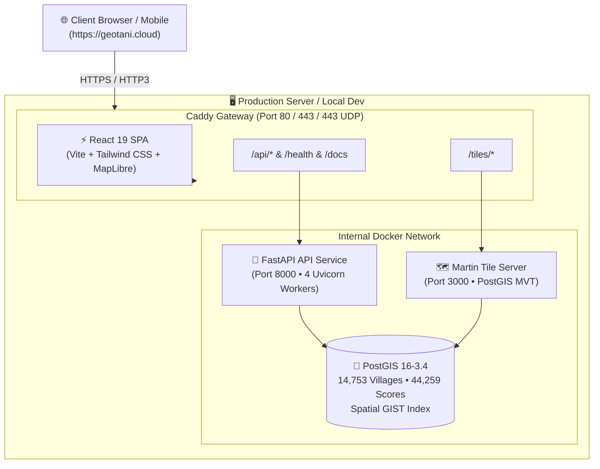

# 🌾 GeoTani

**Open-source agricultural land suitability mapping & geospatial intelligence for Indonesia — village-level precision, zero cost.**

> *"geo"* = spatial / mapping • *"tani"* (🇮🇩) = farmer / agriculture

[](LICENSE)
[](https://geotani.cloud)
[](https://www.python.org/)
[](https://nodejs.org/)
[](https://postgis.net/)
[](https://fastapi.tiangolo.com/)
[](https://maplibre.org/)

---

## 📖 Overview

GeoTani is an interactive geospatial intelligence platform that calculates and visualizes **how suitable land is for specific crops** across Indonesia at the village (*desa/kelurahan*) level.

### 🌟 Key Features

* **Village-Level Resolution**: Detailed evaluation for **14,753 villages** across 3 pilot provinces (Lampung, Jawa Timur, Sulawesi Selatan) plus nationwide regency coverage.
* **Multi-Criteria Environmental Engine**:
  * 🌡️ **Climate**: Mean Annual Temperature & Rainfall from **WorldClim v2.1**
  * 🧪 **Soil**: pH ($H_2O$), Clay %, Sand %, and Soil Organic Carbon (SOC) from **ISRIC SoilGrids v2.0**
  * ⛰️ **Terrain**: 30m Elevation & Slope gradients from **Copernicus GLO-30 DEM**
  * 🛣️ **Accessibility**: Euclidean proximity to drivable road networks from **OpenStreetMap**
* **Smooth Vector Heatmap**: MapLibre GL JS GPU-accelerated client-side rendering powered by **Martin Vector Tile Server**.
* **Zero-Config Production HTTPS**: Fully containerized multi-stage Docker build with automated **Let's Encrypt / ZeroSSL TLS (HTTP/3 + QUIC)** via Caddy.
* **Multi-Crop Catalogs**: Calibrated suitability curves for **Coffee (Robusta)**, **Cocoa**, and **Sugarcane**.

---

## 🏗️ Architecture



---

## 💻 Local Development Setup

### 1. Prerequisites & System Requirements

#### Hardware & Storage Requirements

| Resource | Minimum Requirement | Recommended | Purpose |
|---|---|---|---|
| 💾 **Storage / Disk** | **10 GB** SSD / NVMe | **20 GB+** SSD / NVMe | ~1 GB for Docker images, ~100 MB PostGIS database, ~3–5 GB for ETL raster downloads & backup snapshots |
| 🧠 **RAM / Memory** | **2 GB** (+ 2GB Swap) | **4 GB+** | 2 GB is sufficient for web map serving; 4 GB speeds up parallel raster zonal calculations |
| ⚙️ **CPU** | 1 vCPU / Core | 2+ vCPUs | Standard `x86_64` or `arm64` architecture |

#### Software Dependencies
* **Docker & Docker Compose v2**
* **Python 3.12+**
* **Node.js 20+**

### 2. Clone and Setup Environment
```bash
# Clone the repository
git clone https://github.com/robitalhazmi/geotani.git
cd geotani

# Copy environment variables
cp .env.example .env

# Start database, API, and vector tile server
docker compose up -d
```

### 3. Setup Python Virtual Environment (for ETL & Scoring Engine)
```bash
python3 -m venv .venv
source .venv/bin/activate
pip install --upgrade pip
pip install -r requirements.txt
pip install -e .

# Run test suite to verify installation (18/18 tests)
pytest tests/ -v
```

### 4. Start Frontend Development Server
```bash
cd frontend
npm install
npm run dev
```

* **Frontend Web Map**: `http://localhost:5173`
* **Backend API Docs**: `http://localhost:8000/docs`
* **API Health Check**: `http://localhost:8000/health`
* **Martin Vector Tiles**: `http://localhost:3000/village_suitability/0/0/0`

---

## 🌐 Instant Live Demo Sharing

To generate a secure public HTTPS URL and share your local map with external stakeholders or demo it on a mobile device without deploying:

```bash
./scripts/share_demo.sh
```

Choose **Cloudflare Quick Tunnel** (Option 1) to instantly get a live public demo URL (e.g., `https://random-subdomain.trycloudflare.com`).

---

## 🚀 Production Deployment (VPS)

Deploy GeoTani to any Linux VPS (e.g. **Rumahweb**, Hetzner, DigitalOcean, AWS Lightsail) with automated HTTPS on **`geotani.cloud`**.

### 1. Configure DNS Records
At your domain registrar / DNS provider, point:
* **A Record**: `@` $\to$ `YOUR_VPS_IP`
* **A Record**: `www` $\to$ `YOUR_VPS_IP`

### 2. Server Preparation (Ubuntu / Debian)
```bash
# Connect to your VPS
ssh root@YOUR_VPS_IP

# Install Docker & Docker Compose
curl -fsSL https://get.docker.com | sh

# Configure UFW firewall
sudo ufw allow 22/tcp
sudo ufw allow 80/tcp
sudo ufw allow 443/tcp
sudo ufw allow 443/udp
sudo ufw --force enable
```

### 3. Deploy with One Command
```bash
# Clone the repository
git clone https://github.com/robitalhazmi/geotani.git /opt/geotani
cd /opt/geotani

# Run the automated deployment script
sudo ./scripts/deploy.sh
```

### 4. Run the Resumable Data & Scoring Pipeline
If seeding a fresh database, run the end-to-end pipeline inside the container:
```bash
sudo docker compose --env-file .env.prod -f docker-compose.prod.yml run --rm --build api ./scripts/run_etl_pipeline.sh
```

> [!TIP]
> The pipeline is **100% resumable and idempotent**. If interrupted or restarted, it will skip completed downloads/steps and resume right where it left off.

---

## 👥 Multi-User VPS Access Management

Collaborate safely with team members without sharing your root password:

```bash
# List all active user accounts and their SSH keys
sudo ./scripts/manage_vps_users.sh --list

# Add a developer (can edit code & run Docker, no root/sudo access)
sudo ./scripts/manage_vps_users.sh --add alice --role docker --ssh-key "ssh-ed25519 AAAAC3NzaC1..."

# Add a full administrator (sudo + docker)
sudo ./scripts/manage_vps_users.sh --add bob --role admin --ssh-key "ssh-ed25519 AAAAC3NzaC1..."

# Remove a user and delete their workspace
sudo ./scripts/manage_vps_users.sh --delete alice --remove-home
```

---

## 🛡️ Database Backups & Maintenance

### Automated Daily Backups
```bash
# Create a timestamped compressed backup
sudo ./scripts/backup_db.sh /opt/geotani/backups

# Restore a snapshot
sudo ./scripts/restore_db.sh /opt/geotani/backups/geotani_db_YYYYMMDD_HHMMSS.sql.gz
```

### Container Status & Live Logs
```bash
# Check container statuses
sudo docker compose -f docker-compose.prod.yml ps

# View live gateway logs (HTTPS & reverse proxy)
sudo docker compose -f docker-compose.prod.yml logs -f gateway

# View API logs
sudo docker compose -f docker-compose.prod.yml logs -f api
```

---

## 📡 API Endpoints Reference

| Method | Endpoint | Description |
|---|---|---|
| `GET` | `/health` | API status, DB connectivity, and table record counts |
| `GET` | `/docs` | Interactive OpenAPI / Swagger UI documentation |
| `GET` | `/crops` | List all supported crop parameter specifications |
| `GET` | `/crops/{crop_id}` | Detailed fuzzy criteria curves for a crop |
| `GET` | `/villages/{id}` | Single village metadata, all crop scores & factor breakdown |
| `GET` | `/villages/by-pcode/{pcode}` | Lookup village by BPS administrative P-code |
| `GET` | `/scores?crop=...&bbox=...` | Viewport spatial score filtering |
| `GET` | `/tiles/village_suitability/{z}/{x}/{y}` | Mapbox Vector Tile (MVT) stream |

---

## 📁 Project Structure

```
geotani/
├── api/                          # FastAPI backend application
│   ├── main.py                   # App entrypoint & security middleware
│   ├── config.py                 # Environment settings & CORS
│   └── routers/                  # API endpoints (health, crops, villages, scores)
├── etl/                          # Environmental data extraction & scoring engine
│   ├── download/                 # Resumable downloaders (boundaries, climate, soil, DEM, OSM)
│   ├── scoring/                  # Fuzzy logic trapezoidal curves & combination logic
│   ├── boundaries.py             # ADM4 village and ADM2 regency boundary standardizer
│   ├── zonal_stats.py            # Raster zonal statistics extractor (multiprocess & chunked)
│   ├── pipeline.py               # End-to-end scoring pipeline
│   └── load_postgis.py           # PostGIS schema & spatial view creator
├── frontend/                     # React 19 + TypeScript + Vite web map
│   ├── src/components/           # UI components (MapComponent, Navbar, Legend, VillageDetailPanel)
│   └── vite.config.ts            # Vite build configuration with reverse proxy routing
├── scripts/                      # Operational & deployment automation
│   ├── deploy.sh                 # One-command production VPS deployment script
│   ├── run_etl_pipeline.sh       # Resumable end-to-end data pipeline runner
│   ├── manage_vps_users.sh       # Multi-user SSH & role management utility
│   ├── backup_db.sh              # PostGIS automated backup with rotation
│   ├── restore_db.sh             # Disaster recovery database restoration utility
│   └── share_demo.sh             # Instant live public demo sharer (Cloudflare / ngrok)
├── docs/                         # Architecture documentation & guides
│   ├── 01_WALKTHROUGH.md         # Product vision & UX journey
│   ├── 02_TASKS.md               # Phased development backlog & milestones
│   ├── 03_IMPLEMENTATION_PLAN.md # Technical scoring methodology & data specs
│   └── 04_DEPLOYMENT_GUIDE.md    # Complete VPS operator & operations handbook
├── docker-compose.yml            # Local development multi-container stack
├── docker-compose.prod.yml       # Production stack (PostGIS, API, Martin, Caddy)
├── Dockerfile.api                # FastAPI production container
├── Dockerfile.frontend           # Multi-stage React build + Caddy web server
└── Caddyfile                     # Production reverse proxy, TLS, & SPA routing
```

---

## 📚 Further Documentation

* [Walkthrough & Product Vision](docs/01_WALKTHROUGH.md)
* [Phased Task Roadmap](docs/02_TASKS.md)
* [Scoring Engine Methodology](docs/03_IMPLEMENTATION_PLAN.md)
* [Production Deployment & Operations Guide](docs/04_DEPLOYMENT_GUIDE.md)

---

## 🤝 Contributing

Contributions, issues, and feature requests are welcome! See [CONTRIBUTING.md](CONTRIBUTING.md) for guidelines on code standards, local setup, and pull request workflows.

---

## 📄 License

This project is licensed under the Apache 2.0 License — see the [LICENSE](LICENSE) file for details.
