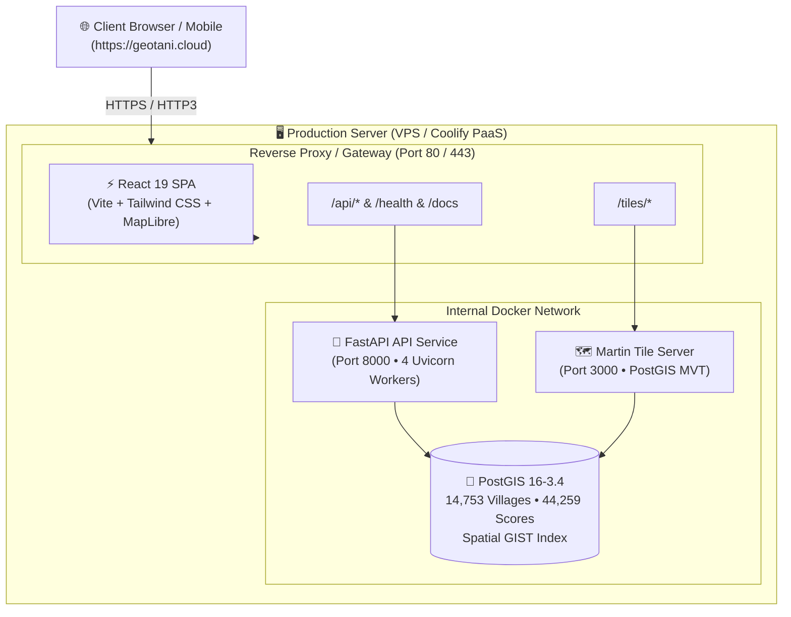

# 🌾 GeoTani

**Open-source agricultural land suitability mapping & geospatial intelligence for Indonesia — village-level precision, zero cost.**

> *"geo"* = spatial / mapping • *"tani"* (🇮🇩) = farmer / agriculture

[](LICENSE)
[](https://geotani.cloud)
[](https://www.python.org/)
[](https://nodejs.org/)
[](https://postgis.net/)
[](https://fastapi.tiangolo.com/)
[](https://maplibre.org/)
[](https://coolify.io)

---

## 📖 Overview

GeoTani is an interactive geospatial intelligence platform that evaluates and visualizes **agricultural land suitability for specific crops** across Indonesia at the village (*desa/kelurahan*) level.

### 🌟 Key Features

* **Village-Level Precision**: Granular evaluation for **14,753 villages** across 3 pilot provinces (*Lampung, Jawa Timur, Sulawesi Selatan*) alongside nationwide regency-level coverage.
* **Multi-Criteria Environmental Engine**:
  * 🌡️ **Climate**: Mean Annual Temperature & Annual Precipitation from **WorldClim v2.1**
  * 🧪 **Soil**: pH ($H_2O$), Clay %, Sand %, and Soil Organic Carbon (SOC) from **ISRIC SoilGrids v2.0**
  * ⛰️ **Terrain**: 30m Elevation & Slope gradients from **Copernicus GLO-30 DEM**
  * 🛣️ **Accessibility**: Proximity to drivable road networks from **OpenStreetMap**
* **Unified Single-Resolution Heatmap**: Seamless vector choropleth mapping across all zoom levels (zoom 3 to 14) powered by **Martin Vector Tile Server** and **MapLibre GL JS**, featuring zoom-adaptive boundary line fading and zero tile flicker.
* **Dual Production Deployment**: Ready out-of-the-box for **Coolify PaaS** (Traefik) or **Native VPS** (Caddy + automated Let's Encrypt / HTTP/3 QUIC).
* **Multi-Crop Catalogs**: Calibrated FAO-standard suitability curves for **Coffee (Robusta)**, **Cocoa**, and **Sugarcane**.
* **Resumable ETL Pipeline**: Atomic, fault-tolerant downloading and zonal raster extraction with built-in checkpointing.

---

## 🏗️ Architecture



---

## 💻 Local Development Setup

### 1. Prerequisites & System Requirements

#### Hardware & Storage Requirements

| Resource | Minimum Requirement | Recommended | Purpose |
|---|---|---|---|
| 💾 **Storage / Disk** | **10 GB** SSD / NVMe | **20 GB+** SSD / NVMe | ~1.2 GB Docker images, ~100 MB PostGIS database, ~3–5 GB for ETL raster downloads & backups |
| 🧠 **RAM / Memory** | **2 GB** (+ 2GB Swap) | **4 GB+** | 2 GB is sufficient for web map serving; 4 GB speeds up parallel raster zonal calculations |
| ⚙️ **CPU** | 1 vCPU / Core | 2+ vCPUs | Standard `x86_64` or `arm64` architecture |

#### Software Dependencies
* **Docker & Docker Compose v2**
* **Python 3.12+**
* **Node.js 20+**

---

### 2. Clone and Setup Environment

```bash
# Clone the repository
git clone https://github.com/robitalhazmi/geotani.git
cd geotani

# Copy environment variables
cp .env.example .env

# Start database, API, and vector tile server
docker compose up -d
```

---

### 3. Setup Python Virtual Environment (for ETL & Scoring Engine)

```bash
python3 -m venv .venv
source .venv/bin/activate
pip install --upgrade pip
pip install -r requirements.txt
pip install -e .

# Run test suite to verify installation
pytest tests/ -v
```

---

### 4. Start Frontend Development Server

```bash
cd frontend
npm install
npm run dev
```

* **Frontend Web Map**: `http://localhost:5173`
* **Backend API Docs**: `http://localhost:8000/docs`
* **API Health Check**: `http://localhost:8000/health`
* **Martin Vector Tiles**: `http://localhost:3000/village_suitability/0/0/0`

---

### 5. Instant Live Demo Sharing

To generate a secure public HTTPS URL and share your local map with stakeholders or demo on mobile devices without deploying:

```bash
./scripts/share_demo.sh
```

Select **Cloudflare Quick Tunnel** (Option 1) to instantly get a live public demo URL (e.g., `https://random-subdomain.trycloudflare.com`).

---

## 🚀 Production Deployment

GeoTani can be deployed via **Coolify PaaS** (recommended for self-hosted cloud management) or directly on a **Native Linux VPS** with Caddy.

```
                  ┌─────────────────────────────────┐
                  │   Choose Deployment Method      │
                  └────────────────┬────────────────┘
                                   │
                ┌──────────────────┴──────────────────┐
                ▼                                     ▼
     ┌───────────────────────┐             ┌───────────────────────┐
     │  Method A: Coolify    │             │  Method B: Native VPS │
     │  PaaS (Docker Compose)│             │  (Caddy + Script)     │
     └───────────────────────┘             └───────────────────────┘
```

---

### Method A: Coolify PaaS Deployment *(Recommended)*

Coolify is an open-source, self-hosted PaaS alternative to Heroku/Vercel.

#### Step 1: Point Your DNS Records
At your domain DNS provider (e.g. Cloudflare, Rumahweb DNS):
* **A Record**: `@` $\to$ `YOUR_VPS_IP`
* **A Record**: `www` $\to$ `YOUR_VPS_IP`

#### Step 2: Create Docker Compose Resource in Coolify
1. In your Coolify dashboard, click **+ Add Resource** $\to$ **Docker Compose**.
2. Connect your Git repository:
   * **Repository URL**: `https://github.com/robitalhazmi/geotani.git`
   * **Branch**: `main`
   * **Compose File Location**: `/docker-compose.coolify.yml`
3. Under **Environment Variables**, define:

| Key | Example Value | Description |
|---|---|---|
| `DOMAIN_NAME` | `geotani.cloud` | Root domain for routing |
| `CORS_ORIGINS` | `https://geotani.cloud,https://www.geotani.cloud` | Allowed web origins |
| `POSTGRES_USER` | `geotani` | PostgreSQL user |
| `POSTGRES_PASSWORD` | `<secure_password>` | PostgreSQL password |
| `POSTGRES_DB` | `geotani` | PostgreSQL database |

4. Click **Deploy**. Coolify's built-in Traefik reverse proxy will automatically acquire Let's Encrypt SSL certificates.

#### Step 3: Run the Resumable ETL Data Seeding Pipeline
Once containers are running on your VPS, execute the data pipeline inside the `api` container:

```bash
# 1. Trigger the end-to-end data pipeline
sudo docker exec -it $(sudo docker ps | grep -E "api-" | awk '{print $1}') ./scripts/run_etl_pipeline.sh

# 2. Restart the Martin tile server to flush vector tile cache
sudo docker restart $(sudo docker ps | grep -E "tiles-" | awk '{print $1}')
```

---

### Method B: Native Linux VPS Deployment *(Caddy + Automated Script)*

Deploy directly to any Ubuntu/Debian VPS (Rumahweb, Hetzner, DigitalOcean, AWS):

#### Step 1: Server Preparation
```bash
# Connect to your VPS
ssh root@YOUR_VPS_IP

# Install Docker & Docker Compose
curl -fsSL https://get.docker.com | sh

# Configure UFW firewall
sudo ufw allow 22/tcp
sudo ufw allow 80/tcp
sudo ufw allow 443/tcp
sudo ufw allow 443/udp
sudo ufw --force enable
```

#### Step 2: One-Command Deployment
```bash
# Clone the repository
git clone https://github.com/robitalhazmi/geotani.git /opt/geotani
cd /opt/geotani

# Run the automated deployment script
sudo ./scripts/deploy.sh
```

#### Step 3: Run ETL Data Pipeline
```bash
# Ingest boundaries, rasters, and suitability scores:
sudo docker compose --env-file .env.prod -f docker-compose.prod.yml run --rm api ./scripts/run_etl_pipeline.sh

# Restart Martin tile server:
sudo docker compose --env-file .env.prod -f docker-compose.prod.yml restart tiles
```

> [!TIP]
> The ETL pipeline is **100% resumable and idempotent**. If interrupted, it skips completed steps and resumes automatically.

---

## 🧹 VPS Disk Space Optimization *(Reclaim ~10–15 GB)*

After builds and raster ETL processing, clean up temporary build layers and raw archives using these sequential steps:

```bash
# 1. Prune Docker BuildKit build cache (~5 GB reclaimed)
sudo docker builder prune -a -f

# 2. Prune dangling and unused Docker images
sudo docker image prune -a -f

# 3. Prune unused Docker volumes
sudo docker volume prune -f

# 4. Purge raw downloaded GIS archives from the container volume (~5–6 GB reclaimed, safe after PostGIS load)
# For Native VPS:
sudo docker compose --env-file .env.prod -f docker-compose.prod.yml run --rm api rm -rf /app/data/raw/* /app/data/processed/elevation/*
# For Coolify VPS:
sudo docker exec -it $(sudo docker ps | grep -E "api-" | awk '{print $1}') rm -rf /app/data/raw/* /app/data/processed/elevation/*

# 5. Vacuum systemd journal logs to 100MB max
sudo journalctl --vacuum-size=100M

# 6. Clean APT package manager cache
sudo apt-get clean && sudo apt-get autoremove --purge -y

# 7. Check updated disk usage
df -h /
sudo docker system df
```

---

## 👥 Multi-User VPS Access Management

Collaborate safely with team members without sharing the root password:

```bash
# List all active user accounts and their SSH keys
sudo ./scripts/manage_vps_users.sh --list

# Add a developer (can edit code & run Docker, no root/sudo access)
sudo ./scripts/manage_vps_users.sh --add alice --role docker --ssh-key "ssh-ed25519 AAAAC3NzaC1..."

# Add an administrator (full sudo + docker)
sudo ./scripts/manage_vps_users.sh --add bob --role admin --ssh-key "ssh-ed25519 AAAAC3NzaC1..."

# Remove a user and delete their workspace
sudo ./scripts/manage_vps_users.sh --delete alice --remove-home
```

---

## 🛡️ Database Backups & Disaster Recovery

### Automated Backups
```bash
# Create a timestamped compressed database backup
sudo ./scripts/backup_db.sh /opt/geotani/backups

# Restore a snapshot
sudo ./scripts/restore_db.sh /opt/geotani/backups/geotani_db_YYYYMMDD_HHMMSS.sql.gz
```

### Nightly Backup Cron Job
Add to `crontab -e`:
```cron
0 2 * * * /opt/geotani/scripts/backup_db.sh /opt/geotani/backups >> /var/log/geotani_backup.log 2>&1
```

---

## 📡 API Endpoints Reference

| Method | Endpoint | Description |
|---|---|---|
| `GET` | `/health` | API status, DB connectivity, and record counts |
| `GET` | `/docs` | Interactive OpenAPI / Swagger UI documentation |
| `GET` | `/crops` | List all supported crop parameter specifications |
| `GET` | `/crops/{crop_id}` | Detailed fuzzy criteria curves for a crop |
| `GET` | `/villages/{id}` | Single village metadata, all crop scores & factor breakdown |
| `GET` | `/villages/by-pcode/{pcode}` | Lookup village by BPS administrative P-code |
| `GET` | `/scores?crop=...&bbox=...` | Viewport spatial score filtering |
| `GET` | `/tiles/village_suitability/{z}/{x}/{y}` | Mapbox Vector Tile (MVT) stream |

---

## 📁 Project Structure

```
geotani/
├── api/                          # FastAPI backend application
│   ├── main.py                   # App entrypoint, middleware, & health check
│   ├── config.py                 # Environment settings & CORS
│   └── routers/                  # API endpoints (health, crops, villages, scores)
├── etl/                          # Environmental data extraction & scoring engine
│   ├── download/                 # Resumable downloaders (boundaries, climate, soil, DEM, OSM)
│   ├── scoring/                  # Fuzzy logic trapezoidal curves & combination logic
│   ├── boundaries.py             # ADM4 village and ADM2 regency boundary standardizer
│   ├── zonal_stats.py            # Raster zonal statistics extractor (multiprocess & chunked)
│   ├── pipeline.py               # End-to-end scoring pipeline
│   └── load_postgis.py           # PostGIS schema & spatial view creator
├── frontend/                     # React 19 + TypeScript + Vite web map
│   ├── src/components/           # UI components (MapComponent, Navbar, Legend, DetailPanel)
│   └── vite.config.ts            # Vite build configuration with reverse proxy routing
├── scripts/                      # Operational & deployment automation
│   ├── deploy.sh                 # One-command production VPS deployment script
│   ├── run_etl_pipeline.sh       # Resumable end-to-end data pipeline runner
│   ├── manage_vps_users.sh       # Multi-user SSH & role management utility
│   ├── backup_db.sh              # PostGIS automated backup with rotation
│   ├── restore_db.sh             # Disaster recovery database restoration utility
│   └── share_demo.sh             # Instant live public demo sharer (Cloudflare / ngrok)
├── docs/                         # Architecture documentation & guides
│   ├── 01_WALKTHROUGH.md         # Product vision & UX journey
│   ├── 02_TASKS.md               # Phased development backlog & milestones
│   ├── 03_IMPLEMENTATION_PLAN.md # Technical scoring methodology & data specs
│   └── 04_DEPLOYMENT_GUIDE.md    # Complete VPS operator & operations handbook
├── docker-compose.yml            # Local development multi-container stack
├── docker-compose.prod.yml       # Production stack for native VPS (PostGIS, API, Martin, Caddy)
├── docker-compose.coolify.yml    # Production stack for Coolify PaaS (Traefik integration)
├── Dockerfile.api                # FastAPI production container
├── Dockerfile.frontend           # Multi-stage React build + Caddy web server
└── Caddyfile                     # Production reverse proxy, TLS, & SPA routing
```

---

## ❓ Troubleshooting & FAQ

<details>
<summary><b>1. Map displays base map but vector choropleth layer is transparent/blank</b></summary>

The Martin vector tile server caches database catalog metadata on boot. If the ETL pipeline ran after Martin started:
```bash
# Restart tile server to refresh catalog
# On Coolify:
sudo docker restart $(sudo docker ps | grep -E "tiles-" | awk '{print $1}')

# On Native VPS:
sudo docker compose --env-file .env.prod -f docker-compose.prod.yml restart tiles
```
</details>

<details>
<summary><b>2. PostgreSQL authentication failed on initial container startup</b></summary>

PostgreSQL sets credentials only upon initial volume initialization. In `docker-compose.coolify.yml`, `POSTGRES_HOST_AUTH_METHOD: trust` is enabled on the private Docker network to ensure seamless communication between `api`, `tiles`, and `db`. If needed, you can synchronize passwords:
```bash
docker exec -i geotani-prod-db psql -U geotani -d postgres -c "ALTER USER geotani WITH PASSWORD 'YOUR_PASSWORD';"
```
</details>

<details>
<summary><b>3. Low-Memory VPS (OOM Killer during ETL raster calculations)</b></summary>

If running on a 1GB–2GB RAM VPS, enable 2GB swap space:
```bash
sudo fallocate -l 2G /swapfile
sudo chmod 600 /swapfile
sudo mkswap /swapfile
sudo swapon /swapfile
```
</details>

---

## 📚 Further Documentation

* [Walkthrough & Product Vision](docs/01_WALKTHROUGH.md)
* [Phased Task Roadmap](docs/02_TASKS.md)
* [Scoring Engine Methodology](docs/03_IMPLEMENTATION_PLAN.md)
* [Production Deployment & Operations Guide](docs/04_DEPLOYMENT_GUIDE.md)

---

## 🤝 Contributing

Contributions, issues, and feature requests are welcome! See [CONTRIBUTING.md](CONTRIBUTING.md) for guidelines on code standards, local setup, and pull request workflows.

---

## 📄 License

This project is licensed under the Apache 2.0 License — see the [LICENSE](LICENSE) file for details.
