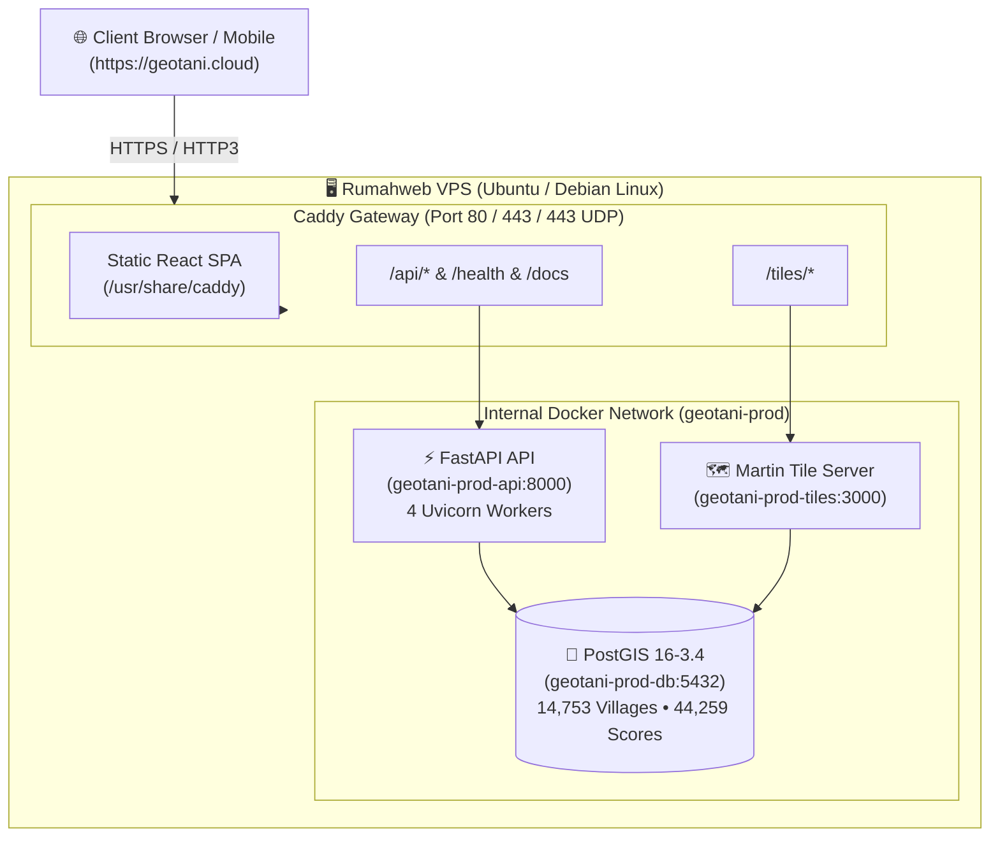

# GeoTani Production Deployment & Operations Guide

This guide covers deploying **GeoTani** to a Linux VPS (e.g. **Rumahweb**, Hetzner, DigitalOcean) with automated HTTPS on **`geotani.cloud`**.

---

## 1. System Architecture



---

## 2. Server Prerequisites & System Requirements

### Hardware Sizing Matrix

| Resource | Minimum Requirement | Recommended | Breakdown |
|---|---|---|---|
| 💾 **Disk Storage** | **10 GB** SSD | **20 GB – 25 GB** NVMe | • ~1.2 GB base Docker images<br>• ~100 MB PostGIS volume<br>• ~3–5 GB for ETL boundary & raster files<br>• ~2–4 GB for swapfile and daily backup snapshots |
| 🧠 **RAM / Memory** | **2 GB** (+ 2GB Swap) | **4 GB+** | 2 GB is sufficient for production serving; 4 GB speeds up parallel raster zonal stats |
| ⚙️ **CPU** | 1 vCPU | 2+ vCPUs | Standard `x86_64` (Intel/AMD) or `arm64` |
| 🐧 **Operating System** | Ubuntu 22.04 / 24.04 LTS | Ubuntu 24.04 LTS | Debian 12 also fully supported |

---

## 3. Step-by-Step VPS Setup

### Step 3.1: Connect to Your VPS
```bash
ssh root@YOUR_VPS_IP
```

### Step 3.2: Update System & Install Docker
```bash
# Update package index
sudo apt update && sudo apt upgrade -y

# Install prerequisite tools
sudo apt install -y curl git ufw gzip

# Install official Docker & Docker Compose
curl -fsSL https://get.docker.com -o get-docker.sh
sudo sh get-docker.sh

# Verify Docker installation
docker --version
docker compose version
```

### Step 3.3: Configure UFW Firewall
```bash
# Allow SSH, HTTP, HTTPS, and HTTP/3 UDP
sudo ufw allow 22/tcp
sudo ufw allow 80/tcp
sudo ufw allow 443/tcp
sudo ufw allow 443/udp

# Enable firewall
sudo ufw --force enable
sudo ufw status
```

---

## 4. Domain & DNS Configuration (`geotani.cloud`)

In your domain DNS manager (Rumahweb DNS / Cloudflare / registrar):

| Type | Host / Name | Value / Destination | TTL |
|---|---|---|---|
| **A** | `@` (root) | `YOUR_VPS_IP` | Auto / 300s |
| **A** | `www` | `YOUR_VPS_IP` | Auto / 300s |

> [!NOTE]
> Ensure DNS changes have propagated before launching Caddy so the Let's Encrypt / ZeroSSL ACME challenge succeeds. You can check propagation with `dig +short geotani.cloud` or `nslookup geotani.cloud`.

---

## 5. Deploying GeoTani

GeoTani supports two primary production deployment tracks:
* **Track A: Coolify PaaS (Docker Compose)** — Recommended for self-hosted cloud environments with automatic SSL and multi-app management.
* **Track B: Native Linux VPS (Caddy + Shell Automation)** — Recommended for standalone dedicated Ubuntu/Debian instances.

---

### Track A: Coolify PaaS Deployment

Coolify is an open-source, self-hosted PaaS that provides a web-based dashboard and automated Traefik reverse proxy.

#### Step A.1: Create Resource in Coolify
1. In the Coolify Dashboard, click **+ Add Resource** → **Docker Compose**.
2. Select your Git source and configure:
   * **Repository URL**: `https://github.com/robitalhazmi/geotani.git`
   * **Branch**: `main`
   * **Docker Compose Location**: `/docker-compose.coolify.yml`

#### Step A.2: Configure Environment Variables
Under the **Environment Variables** tab for the newly created resource, configure:

| Variable | Example Value | Description |
|---|---|---|
| `DOMAIN_NAME` | `geotani.cloud` | Production domain name |
| `CORS_ORIGINS` | `https://geotani.cloud,https://www.geotani.cloud` | Allowed HTTP CORS origins |
| `POSTGRES_USER` | `geotani` | PostgreSQL username |
| `POSTGRES_PASSWORD` | `<secure_random_password>` | PostgreSQL database password |
| `POSTGRES_DB` | `geotani` | PostgreSQL database name |

#### Step A.3: Deploy Application Stack
Click **Deploy**. Coolify builds the React frontend with Caddy, starts FastAPI, PostGIS 16, and Martin, and connects the gateway to Traefik on the `coolify` external network with automatic Let's Encrypt certificates.

#### Step A.4: Run the Resumable ETL Data Seeding Pipeline
On your VPS terminal, execute the data pipeline inside the running API container:

```bash
# 1. Trigger the end-to-end data pipeline
sudo docker exec -it $(sudo docker ps | grep -E "api-" | awk '{print $1}') ./scripts/run_etl_pipeline.sh

# 2. Restart the Martin tile server to flush vector tile cache
sudo docker restart $(sudo docker ps | grep -E "tiles-" | awk '{print $1}')
```

---

### Track B: Native Linux VPS Deployment (Caddy + Automated Script)

#### Step B.1: Clone the Repository
```bash
git clone https://github.com/robitalhazmi/geotani.git /opt/geotani
cd /opt/geotani
```

#### Step B.2: Configure Environment Variables
```bash
cp .env.prod.example .env.prod
nano .env.prod
```

Configure your domain and credentials:
```env
DOMAIN_NAME=geotani.cloud
CORS_ORIGINS=https://geotani.cloud,https://www.geotani.cloud
POSTGRES_USER=geotani
POSTGRES_PASSWORD=YOUR_SECURE_STRONG_PASSWORD
POSTGRES_DB=geotani
```

#### Step B.3: Run the Automated Deployment Script
```bash
./scripts/deploy.sh
```

#### Step B.4: Seeding Database on Fresh VPS

Since raw and processed geospatial datasets are not tracked in Git, run the automated end-to-end data pipeline directly on your VPS:

```bash
# Run the complete automated ETL pipeline inside the API container:
sudo docker compose --env-file .env.prod -f docker-compose.prod.yml run --rm api ./scripts/run_etl_pipeline.sh

# Restart Martin tile server:
sudo docker compose --env-file .env.prod -f docker-compose.prod.yml restart tiles
```

The pipeline will automatically:
1. Download official Indonesian village and regency boundaries from HDX/BPS.
2. Filter and standardize the 3 pilot provinces (14,753 villages) plus nationwide coarse boundaries.
3. Ingest geometries into PostGIS with spatial indexing (`GIST`).
4. Download environmental rasters (WorldClim, SoilGrids, SRTM, OSM) and compute zonal statistics.
5. Score all villages across Coffee, Cocoa, and Sugarcane and populate the `suitability_scores` table.
6. Refresh the Martin vector tile server.

---

## 6. Verification & Operational Health

Test all endpoints once deployment is complete:

```bash
# 1. Check container statuses
# On Native VPS:
docker compose -f docker-compose.prod.yml ps
# On Coolify VPS:
sudo docker ps

# 2. Check API health endpoint
curl -I https://geotani.cloud/health

# 3. Check sample vector tile (Protobuf)
curl -I https://geotani.cloud/tiles/village_suitability/6/51/33
```

---

## 7. Automated Backups & Disaster Recovery

### Manual Backup:
```bash
./scripts/backup_db.sh /opt/geotani/backups
```

### Automated Nightly Backup via Cron:
Add a daily cron job at 02:00 AM:
```bash
crontab -e
```
Add the following line:
```cron
0 2 * * * /opt/geotani/scripts/backup_db.sh /opt/geotani/backups >> /var/log/geotani_backup.log 2>&1
```

### Database Restoration:
To restore a snapshot:
```bash
./scripts/restore_db.sh /opt/geotani/backups/geotani_db_YYYYMMDD_HHMMSS.sql.gz
```

---

## 8. Free Uptime Monitoring Setup

To ensure 99.9% uptime, set up a free monitor using **UptimeRobot** or **BetterStack**:

1. Create a free account at [UptimeRobot.com](https://uptimerobot.com).
2. Click **Add New Monitor**:
   - **Monitor Type**: `HTTP(s)`
   - **Friendly Name**: `GeoTani Production API`
   - **URL**: `https://geotani.cloud/health`
   - **Monitoring Interval**: Every 5 minutes
3. Set alert notification channels (Email / Telegram / Slack).

---

## 9. Maintenance & Container Logs

```bash
# View live gateway logs (Caddy / HTTPS)
docker compose -f docker-compose.prod.yml logs -f gateway

# View backend API logs
docker compose -f docker-compose.prod.yml logs -f api

# View Martin tile server logs
docker compose -f docker-compose.prod.yml logs -f tiles

# Update and restart with zero downtime
git pull origin main
docker compose -f docker-compose.prod.yml up -d --build
```

### Troubleshooting:

* **PostgreSQL Password Authentication Failed**:
  If you changed `POSTGRES_PASSWORD` in `.env.prod` after the database container was already created, synchronize the password in Postgres:
  ```bash
  source .env.prod
  docker exec -i geotani-prod-db psql -U geotani -d postgres -c "ALTER USER \"$POSTGRES_USER\" WITH PASSWORD '$POSTGRES_PASSWORD';"
  ```
  Or if the database is still empty and you want a clean reset:
  ```bash
  docker compose -f docker-compose.prod.yml down -v
  ./scripts/deploy.sh
  ```

* **Low-Memory VPS (OOM Killer)**:
  If running on a 1GB–2GB RAM VPS, ensure swap space is enabled:
  ```bash
  sudo fallocate -l 2G /swapfile
  sudo chmod 600 /swapfile
  sudo mkswap /swapfile
  sudo swapon /swapfile
  ```

---

## 10. Multi-User Access & Collaborator Management

Sharing your root password with other developers is a security risk. Instead, create separate user accounts with their own SSH public keys and specific privilege levels.

### Option A: Using the Automated User Management Tool (Fastest)

Run the included helper script on your VPS:

```bash
# 1. List all human users, UIDs, permission groups, and active SSH keys
sudo ./scripts/manage_vps_users.sh --list

# 2. Add a developer (can manage Docker containers & edit code, NO root sudo)
sudo ./scripts/manage_vps_users.sh --add alice --role docker --ssh-key "ssh-ed25519 AAAAC3NzaC1lZDI1NTE5..."

# 3. Add an administrator (full sudo + docker)
sudo ./scripts/manage_vps_users.sh --add bob --role admin --ssh-key "ssh-ed25519 AAAAC3NzaC1lZDI1NTE5..."

# 4. Remove a user account (and delete their home directory)
sudo ./scripts/manage_vps_users.sh --delete alice --remove-home

# 5. Temporarily lock/disable a user account without deleting files
sudo ./scripts/manage_vps_users.sh --lock bob
sudo ./scripts/manage_vps_users.sh --unlock bob
```

---

### Option B: Manual User Management (Step-by-Step CLI)

#### 1. List Existing Users on the VPS:
```bash
# List all human user accounts (UID >= 1000):
awk -F: '$3 >= 1000 && $3 < 65534 {print $1, "UID:", $3, "Home:", $6}' /etc/passwd

# See who is currently logged in:
w
# or
who

# Check members of sudo or docker groups:
getent group sudo
getent group docker
```

#### 2. Create a User Account:
```bash
sudo adduser developer1
```

#### 2. Configure their specific permissions:

* **For a Developer (Docker & Git access without root/sudo)**:
  ```bash
  # Grant Docker permissions so they can run `docker compose`
  sudo usermod -aG docker developer1

  # Grant group permissions to the GeoTani project directory
  sudo chgrp -R docker /opt/geotani
  sudo chmod -R g+rwX /opt/geotani
  ```

* **For an Administrator (Full sudo access)**:
  ```bash
  sudo usermod -aG sudo,docker developer1
  ```

#### 3. Install their SSH Public Key:
Ask the developer to generate an SSH key on their local machine (`ssh-keygen -t ed25519`) and send you their **public key** (`~/.ssh/id_ed25519.pub`).

On the VPS, install their key:
```bash
sudo mkdir -p /home/developer1/.ssh
sudo chmod 700 /home/developer1/.ssh

# Paste their public key into authorized_keys
echo "ssh-ed25519 AAAAC3NzaC1lZDI1NTE5... user@laptop" | sudo tee -a /home/developer1/.ssh/authorized_keys

# Fix file permissions and ownership
sudo chmod 600 /home/developer1/.ssh/authorized_keys
sudo chown -R developer1:developer1 /home/developer1/.ssh
```

#### 4. How the collaborator connects:
The collaborator can now SSH into the VPS directly using their own private key:
```bash
ssh developer1@geotani.cloud
# or
ssh developer1@YOUR_VPS_IP
```

#### 5. Delete or Remove a User Account:
```bash
# Terminate any active sessions/processes belonging to the user
sudo killall -u developer1

# Remove user AND delete their home directory files
sudo deluser --remove-home developer1

# Or remove user while preserving their files
sudo deluser developer1
```

#### 6. Temporarily Lock / Disable Access (Without Deleting):
```bash
# Lock user password/SSH access
sudo usermod -L developer1

# Unlock user access
sudo usermod -U developer1
```

---

### 11. Production SSH Security Hardening (Best Practices)

Once all legitimate user accounts and SSH keys are active, lock down SSH to eliminate brute-force password attacks:

```bash
sudo nano /etc/ssh/sshd_config
```

Ensure the following settings are enabled:
```sshconfig
# Disable root login over SSH
PermitRootLogin no

# Disable password-based logins (require SSH keys only)
PasswordAuthentication no

# Disable empty passwords
PermitEmptyPasswords no
```

Restart the SSH service:
```bash
sudo systemctl restart ssh
```

---

### 12. VPS Disk Space Optimization & Routine Maintenance

To keep your VPS storage clean and reclaim **10–15+ GB** after builds and ETL data runs:

```bash
# 1. Prune Docker BuildKit build cache (~5 GB)
sudo docker builder prune -a -f

# 2. Prune old/dangling container images
sudo docker image prune -a -f

# 3. Prune unused Docker volumes
sudo docker volume prune -f

# 4. Clean raw downloaded GIS archives from the named volume (~5–6 GB, safe after PostGIS load)
# For Native VPS:
sudo docker compose --env-file .env.prod -f docker-compose.prod.yml run --rm api rm -rf /app/data/raw/* /app/data/processed/elevation/*
# For Coolify VPS:
sudo docker exec -it $(sudo docker ps | grep -E "api-" | awk '{print $1}') rm -rf /app/data/raw/* /app/data/processed/elevation/*

# 5. Vacuum systemd journal logs to 100MB max
sudo journalctl --vacuum-size=100M

# 6. Clean APT package cache
sudo apt-get clean && sudo apt-get autoremove --purge -y

# 7. Check updated disk usage
df -h /
sudo docker system df
```


