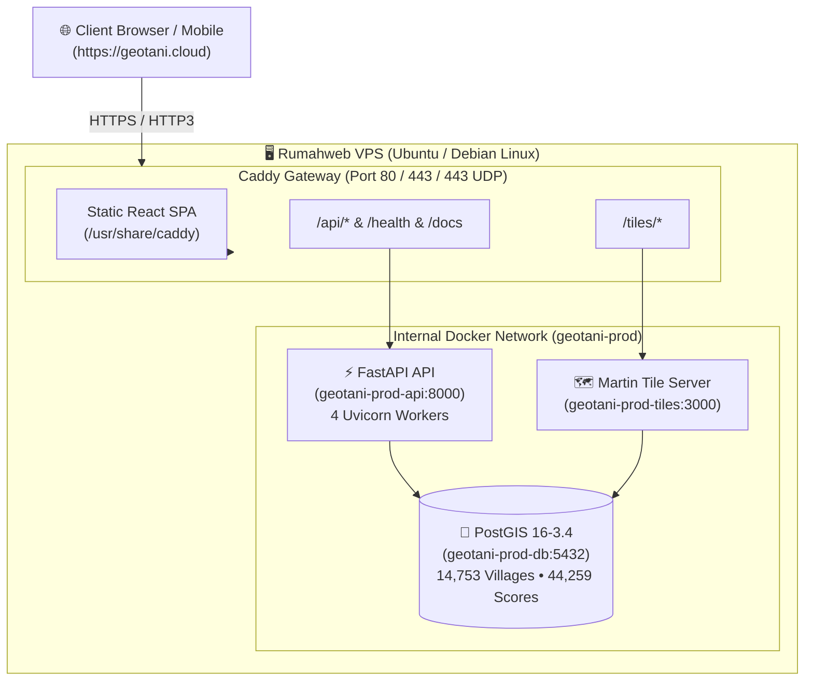

# GeoTani Production Deployment & Operations Guide

This guide covers deploying **GeoTani** to a Linux VPS (e.g. **Rumahweb**, Hetzner, DigitalOcean) with automated HTTPS on **`geotani.cloud`**.

---

## 1. System Architecture



---

## 2. Server Prerequisites

### Recommended VPS Specifications:
* **RAM**: 2 GB – 4 GB (4 GB recommended for ETL pipelines and tile concurrency)
* **vCPU**: 1 – 2 vCPUs
* **Disk**: 25 GB+ SSD / NVMe
* **OS**: Ubuntu 22.04 LTS or 24.04 LTS (or Debian 12)

---

## 3. Step-by-Step VPS Setup

### Step 3.1: Connect to Your VPS
```bash
ssh root@YOUR_VPS_IP
```

### Step 3.2: Update System & Install Docker
```bash
# Update package index
sudo apt update && sudo apt upgrade -y

# Install prerequisite tools
sudo apt install -y curl git ufw gzip

# Install official Docker & Docker Compose
curl -fsSL https://get.docker.com -o get-docker.sh
sudo sh get-docker.sh

# Verify Docker installation
docker --version
docker compose version
```

### Step 3.3: Configure UFW Firewall
```bash
# Allow SSH, HTTP, HTTPS, and HTTP/3 UDP
sudo ufw allow 22/tcp
sudo ufw allow 80/tcp
sudo ufw allow 443/tcp
sudo ufw allow 443/udp

# Enable firewall
sudo ufw --force enable
sudo ufw status
```

---

## 4. Domain & DNS Configuration (`geotani.cloud`)

In your domain DNS manager (Rumahweb DNS / Cloudflare / registrar):

| Type | Host / Name | Value / Destination | TTL |
|---|---|---|---|
| **A** | `@` (root) | `YOUR_VPS_IP` | Auto / 300s |
| **A** | `www` | `YOUR_VPS_IP` | Auto / 300s |

> [!NOTE]
> Ensure DNS changes have propagated before launching Caddy so the Let's Encrypt / ZeroSSL ACME challenge succeeds. You can check propagation with `dig +short geotani.cloud` or `nslookup geotani.cloud`.

---

## 5. Deploying GeoTani

### Step 5.1: Clone the Repository
```bash
git clone https://github.com/robitalhazmi/geotani.git /opt/geotani
cd /opt/geotani
```

### Step 5.2: Configure Environment Variables
```bash
cp .env.prod.example .env.prod
nano .env.prod
```

Configure your domain and credentials:
```env
DOMAIN_NAME=geotani.cloud
CORS_ORIGINS=https://geotani.cloud,https://www.geotani.cloud
POSTGRES_USER=geotani
POSTGRES_PASSWORD=YOUR_SECURE_STRONG_PASSWORD
POSTGRES_DB=geotani
```

### Step 5.3: Run the Automated Deployment Script
```bash
./scripts/deploy.sh
```

The script will:
1. Verify Docker & Compose.
2. Build the optimized multi-stage React SPA + Caddy container.
3. Launch PostGIS, FastAPI, Martin, and Caddy.
4. Verify database health and seed initial geospatial datasets.
5. Confirm public endpoints.

---

## 6. Verification & Operational Health

Test all endpoints once deployment is complete:

```bash
# 1. Check container statuses
docker compose -f docker-compose.prod.yml ps

# 2. Check API health endpoint
curl -I https://geotani.cloud/health

# 3. Check sample vector tile (Protobuf)
curl -I https://geotani.cloud/tiles/village_suitability/6/51/33
```

---

## 7. Automated Backups & Disaster Recovery

### Manual Backup:
```bash
./scripts/backup_db.sh /opt/geotani/backups
```

### Automated Nightly Backup via Cron:
Add a daily cron job at 02:00 AM:
```bash
crontab -e
```
Add the following line:
```cron
0 2 * * * /opt/geotani/scripts/backup_db.sh /opt/geotani/backups >> /var/log/geotani_backup.log 2>&1
```

### Database Restoration:
To restore a snapshot:
```bash
./scripts/restore_db.sh /opt/geotani/backups/geotani_db_YYYYMMDD_HHMMSS.sql.gz
```

---

## 8. Free Uptime Monitoring Setup

To ensure 99.9% uptime, set up a free monitor using **UptimeRobot** or **BetterStack**:

1. Create a free account at [UptimeRobot.com](https://uptimerobot.com).
2. Click **Add New Monitor**:
   - **Monitor Type**: `HTTP(s)`
   - **Friendly Name**: `GeoTani Production API`
   - **URL**: `https://geotani.cloud/health`
   - **Monitoring Interval**: Every 5 minutes
3. Set alert notification channels (Email / Telegram / Slack).

---

## 9. Maintenance & Container Logs

```bash
# View live gateway logs (Caddy / HTTPS)
docker compose -f docker-compose.prod.yml logs -f gateway

# View backend API logs
docker compose -f docker-compose.prod.yml logs -f api

# View Martin tile server logs
docker compose -f docker-compose.prod.yml logs -f tiles

# Update and restart with zero downtime
git pull origin main
docker compose -f docker-compose.prod.yml up -d --build
```
